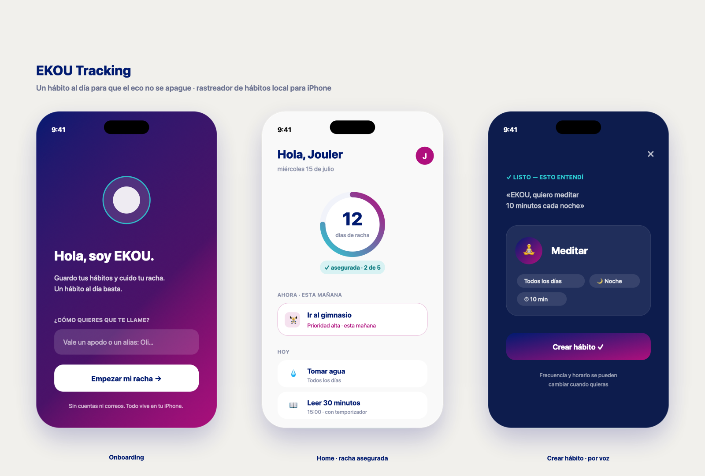

# EKOU Tracking

> Un hábito al día para que el eco no se apague.

**EKOU** es un rastreador de hábitos para iPhone, minimalista y *local-first*. No hay cuentas ni correos: todo vive en el teléfono. El producto gira alrededor de una sola idea — mantener viva tu **racha** — y la protege con la menor fricción posible: **1 toque = hecho**, creación de hábitos por texto o por voz, y una única pantalla Home sin barra de pestañas.

El nombre juega con la idea del *eco* (EKOU / "Echo"): cada día que cumples un hábito, el eco responde y la racha sigue viva.

## Demo

🔗 **[Ver la demo interactiva (pantallas completas)](https://claude.ai/code/artifact/5f9c9f21-9cf2-49ca-9b48-bee7f2690612)**

Diseño y flujo completo en Claude Design: [EKOU Tracking — Pantallas completas](https://claude.ai/design/p/40184b50-35f3-49a7-aa52-068de6bbea10?file=EKOU+Traking+-+Pantallas+completas.dc.html)

## Cómo se ve

*De izquierda a derecha: Onboarding (alta sin fricción), Home con la racha asegurada, y el resultado de crear un hábito por voz.*

## En una frase

Un hábito al día basta para mantener la racha. EKOU pone el hábito prioritario del momento siempre arriba, te deja marcarlo con un toque y usa la voz como copiloto para crear hábitos nuevos — sin pedirte que crees una cuenta.

## Documentación

| Documento | Contenido |
|-----------|-----------|
| [doc/requirements.md](doc/requirements.md) | Necesidad de negocio, alcance del MVP y reglas de negocio. |
| [doc/ux-ui-guidelines.md](doc/ux-ui-guidelines.md) | Principios de UX, sistema visual (paleta, tipografía) e inventario de pantallas. |

> La documentación de **arquitectura** la lleva otro miembro del equipo y no está cubierta aquí.
